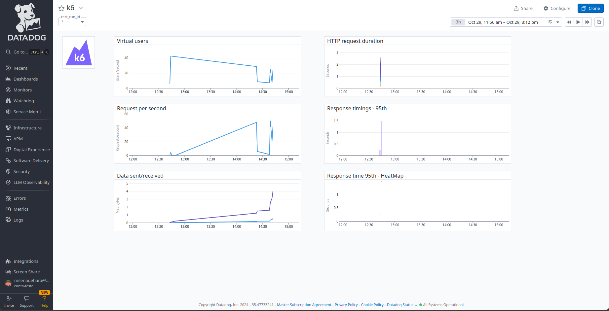

# Send k6 metrics to Datadog
## Tutorial from Grafana

- [Grafana](https://grafana.com/blog/2022/06/23/running-distributed-load-tests-on-kubernetes/) - installs K6 Operator

1. Create secret for the Datadog Api Key.
    ```
    kubectl create secret generic datadog-secret --from-literal api-key=xxx
    ```
2. Install Datadog Agent using Helm.
    ```
    helm repo add datadog https://helm.datadoghq.com
    helm repo update
    helm install datadog-agent -f datadog-values.yaml datadog/datadog
    ```
3. Run k6 test.
    ```
    kubectl create configmap crocodile-stress-test --from-file test.js
    kubectl apply -f k6.yaml
    ```
